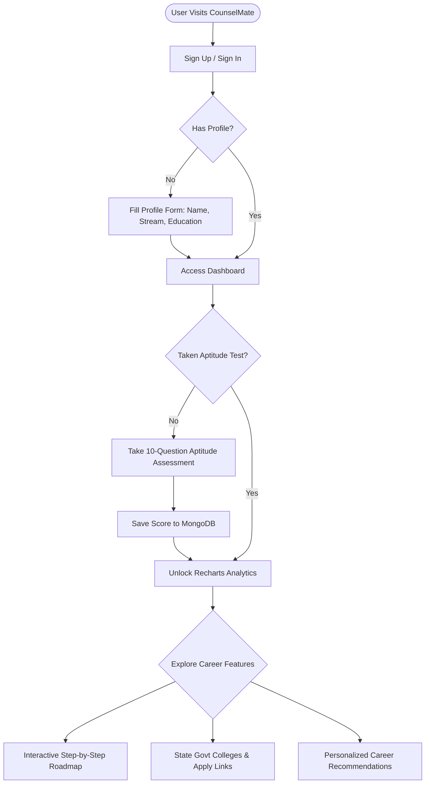

# 🎓 CounselMate

> A modern, full-stack career guidance and counseling platform designed to empower students to discover their academic strengths, evaluate their skills, and map out their path to success.

---

<p align="center">
  
  
  
  
  
  
  
  
</p>

---

## 📌 Table of Contents

- [🚀 Overview](#-overview)
- [🧩 Key Features](#-key-features)
- [⚙️ System Architecture](#️-system-architecture)
- [🛠️ Tech Stack](#️-tech-stack)
- [📂 Directory Layout](#-directory-layout)
- [💻 Installation & Setup](#-installation--setup)
  - [Prerequisites](#prerequisites)
  - [Backend Setup & Environment Variables](#backend-setup--environment-variables)
  - [Frontend Setup](#frontend-setup)
- [🔮 Future Roadmap](#-future-roadmap)
- [👩‍💻 Author](#-author)
- [📄 License](#-license)

---

## 🚀 Overview

Making decisions about academic streams (10th/12th grade) and future careers can be overwhelming. **CounselMate** bridges this gap by providing structured, personalized guidance. By analyzing student demographics, current education levels, specific interests, and real-time aptitude evaluation scores, CounselMate provides dynamic, visual career alignment insights and eligible college matchings.

---

## 🧩 Key Features

- **🔐 Secure Authentication & Session Management**: Built-in authentication (Signup/Login/Logout) backed by Express Sessions and `connect-mongo` session persistence.
- **📝 Profile-driven Onboarding**: A comprehensive student onboarding form capturing academic details, stream preferences, interests, and background.
- **⚡ Interactive Aptitude Assessment**: A custom-designed 10-question evaluation covering logical reasoning, general science, and math. Results are calculated instantly and persisted securely in MongoDB.
- **📊 Dynamic Visual Analytics**: Powered by `Recharts` to draw user-friendly, responsive Pie Charts of career affinity based on user profiles and test scores.
- **🗺️ Interactive Career Roadmap**: Step-by-step guidance showing the exact milestones required to achieve target career paths.
- **🏫 College Matchmaker**: A localized feature focused on State Government Colleges in Jammu & Kashmir (J&K), highlighting available programs and direct application links.

---

## ⚙️ System Architecture

The following flowchart outlines the user journey and system processing flow inside CounselMate:



---

## 🛠️ Tech Stack

### Frontend
- **React.js** (v19) - Declarative, component-driven UI
- **Vite** - High-performance next-generation frontend tooling
- **Tailwind CSS** - Modern utility-first styling framework
- **Recharts** - Responsive SVG chart library for data visualization
- **Lucide React** - Clean and modern SVG icon pack
- **Spline 3D** - For integrating interactive 3D elements and graphics

### Backend
- **Node.js** - Server-side JavaScript runtime
- **Express.js** (v5) - Minimalist web application framework
- **Express Session** & **Connect-Mongo** - Secure server-side sessions with database storage
- **Mongoose & MongoDB** - Object Document Mapping (ODM) and NoSQL database

---

## 📂 Directory Layout

```text
CounselMate/
├── frontend/                   # React Frontend App
│   ├── src/
│   │   ├── assets/             # Images, fonts, and styling assets
│   │   ├── components/         # Reusable UI elements (Navbar, Hero, Charts)
│   │   ├── context/            # AuthContext state provider
│   │   ├── pages/              # Main page views (Dashboard, Signin, Aptitude, etc.)
│   │   ├── App.jsx             # Core React application router
│   │   └── main.jsx            # React app entry point
│   ├── tailwind.config.js      # Tailwind configurations
│   ├── vite.config.js          # Vite tool configurations
│   └── package.json            # Frontend dependency specifications
│
├── backend/                    # Node.js Express Backend API
│   ├── config/                 # DB connections & configurations
│   ├── controllers/            # Controller logic handlers for routes
│   ├── middleware/             # Route authorization and session filters
│   ├── models/                 # Mongoose schemas (User, Profile, Aptitude, College)
│   ├── routes/                 # Express API endpoints
│   ├── index.js                # Core Express application server
│   └── package.json            # Backend dependency specifications
│
└── README.md                   # Project documentation
```

---

## 💻 Installation & Setup

### Prerequisites

Ensure you have the following installed on your machine:
- [Node.js](https://nodejs.org/) (v16 or higher)
- [MongoDB Atlas](https://www.mongodb.com/cloud/atlas) account (or a local MongoDB instance)

---

### Backend Setup & Environment Variables

1. Navigate to the backend directory:
   ```bash
   cd backend
   ```

2. Install dependencies:
   ```bash
   npm install
   ```

3. Create a `.env` file in the root of the `backend/` directory:
   ```env
   PORT=5000
   ATLAS_URI=your_mongodb_connection_string
   SESSION_SECRET=your_super_secure_session_secret
   ```
   > [!IMPORTANT]
   > Replace `your_mongodb_connection_string` with your actual MongoDB Atlas connection string, and specify a unique secret for `SESSION_SECRET`.

4. Start the server (development mode with hot-reloading):
   ```bash
   npm run dev
   ```
   *The backend server will run on `http://localhost:5000`.*

---

### Frontend Setup

1. Open a new terminal window and navigate to the frontend directory:
   ```bash
   cd frontend
   ```

2. Install dependencies:
   ```bash
   npm install
   ```

3. Start the frontend developer server:
   ```bash
   npm run dev
   ```
   *The frontend application will boot up at `http://localhost:5173`.*

---

## 🔮 Future Roadmap

- [ ] **🤖 AI-Powered Mentorship**: Integrate LLM-driven agents to provide conversational, real-time advice.
- [ ] **🧠 Aptitude Assessment Expansion**: Adaptive questions mapped to distinct intellectual fields.
- [ ] **📈 Multi-Region Colleges**: Broaden institutional integrations beyond J&K state colleges.
- [ ] **📝 Resume Builder & Critic**: Dynamic CV generation and advice for higher studies or career entry.

---

## 👩‍💻 Author

**Sakshi Lily**
*B.Tech CSE, GLA University, Mathura*
- GitHub: [@sakshi-lily](https://github.com/sakshi-lily)

---

## 📄 License

This project is open-source and developed for educational and learning purposes under the MIT License.
